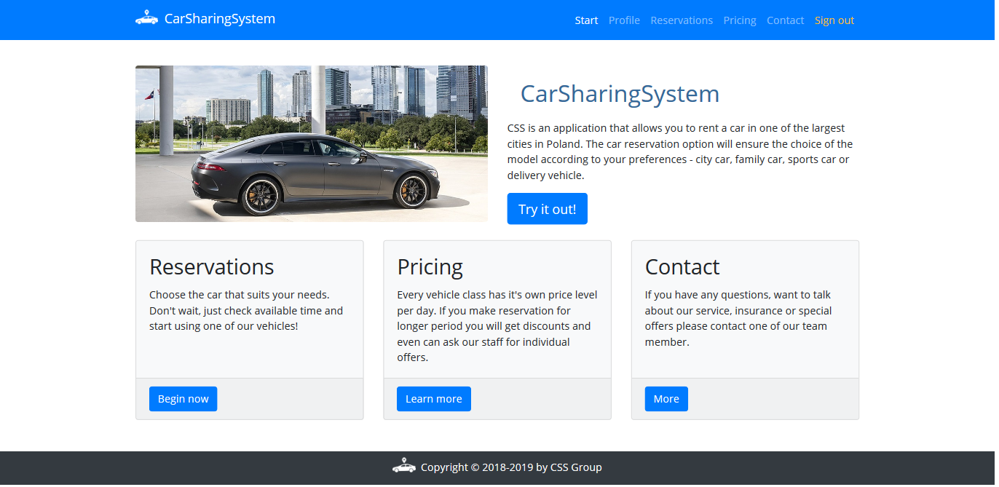

# CSS - CarSharingSystem 

[PL description]
CSS to aplikacja umo¿liwiaj¹ca wynajêcie samochodu w najwiêkszych miastach w Polsce.
Opcja rezerwacji auta zapewni wybór modelu wed³ug w³asnych potrzeb - samochód miejski, rodzinny, sportowy, terenowy, dostawczy.
## G³ówne funkcje aplikacji
* rejestracja u¿ytkownika,
* zmiana danych u¿ytkownika,
* opcja potwierdzenia rezerwacji,
* opcja anulowania rezerwacji,
* opcja kalkulacji kosztów wypo¿yczenia.

### Strona g³ówna
